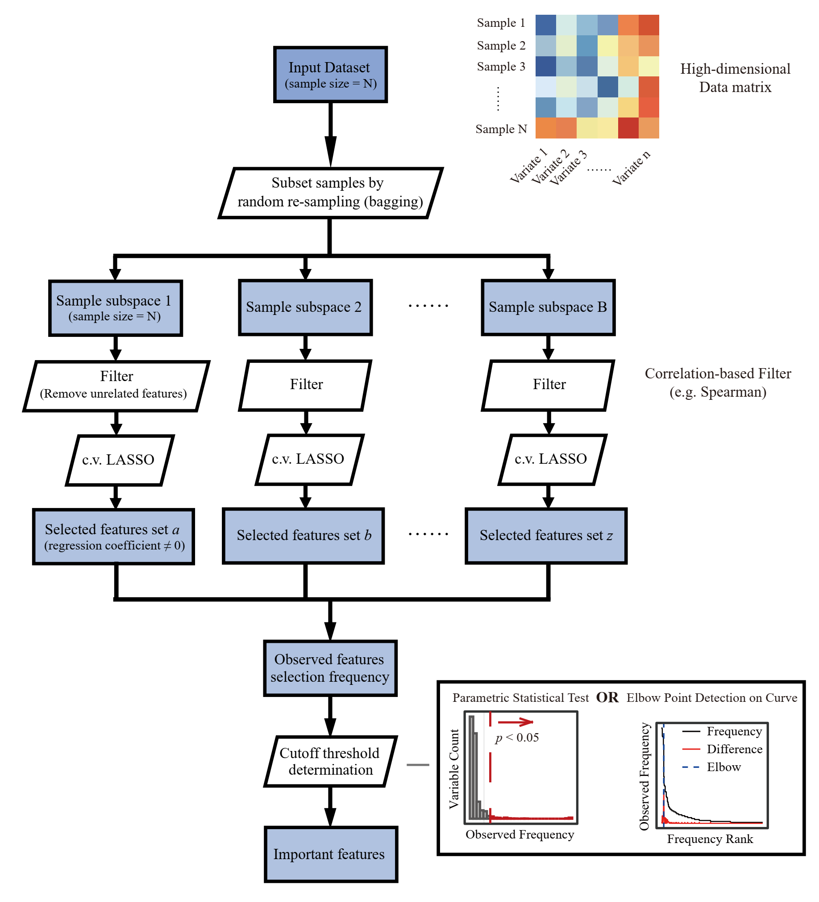
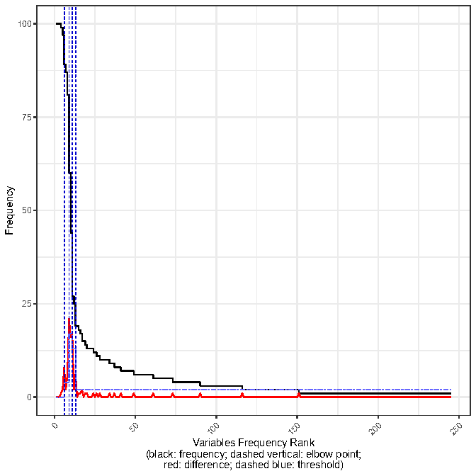
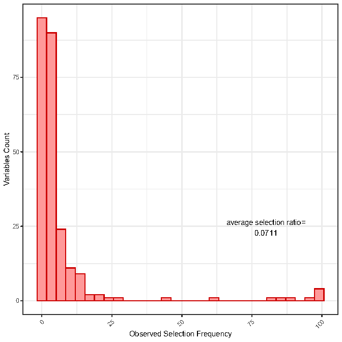

VSOLassoBag installation and usage
==================================

1 Install VSOLassoBag
---------------------

VSOLassoBag can be run in both Windows system and most POSIX systems. The follow codes should be run in R.

 .. code-block:: R   
    
    ## via github
    install.packages("devtools")
    devtools::install_github("likelet/lassoBag")

2 Usage Example
--------------------

2.1 VSOLassoBag
^^^^^^^^^^^^^^^  

VSOLassoBag is an one-step function that can be easily utilized for selecting important variables from multiple models inherited from R package glmnet. 
Several methods (Parametric Statistical Test, Curve Elbow Point Detection and Permutation Test) are provided for the cut-off point decision of the importance measure (i.e. observed selection frequency) of variables.

The algorithm workflow is shown in the follow image:

      

For a start, you need to input dependent variable(s) as a matrix **out.mat**, independent variables also as a matrix **mat**, 
and **a.family** for the model used by Lasso as determined by the type of dependent variables. The function will return a data frame which contains the important measure for each features in the dependent variables. 
The details of its parameters are shown in the parameters section.

You can also tune other parameters to better balance the performance and required resource for analysis. Key parameters include *bootN* for bagging times, and *bagFreq.sigMethod* for the cut-off point decision method.

 .. code-block:: R
    
    # load the example data
    data(simulated_example)
    
    # as shown below, 'a.family' is totally determined by the type of 'out.mat', the dependent variable(s)
    
    # binomial
    res<-VSOLassoBag(mat=test.df$x,out.mat=test.df$label,bootN=100,a.family="binomial",bagFreq.sigMethod="PST")
    res<-VSOLassoBag(mat=test.df$x,out.mat=test.df$label,bootN=100,a.family="binomial",bagFreq.sigMethod="CEP")
    
    # gaussian
    res<-VSOLassoBag(mat=test.df$x,out.mat=test.df$y,bootN=100,a.family="gaussian",bagFreq.sigMethod="PST")
    res<-VSOLassoBag(mat=test.df$x,out.mat=test.df$y,bootN=100,a.family="gaussian",bagFreq.sigMethod="CEP")
    
    # cox
    res<-VSOLassoBag(mat=test.df$x,out.mat=test.df$surv,bootN=100,a.family="cox",bagFreq.sigMethod="PST")
    res<-VSOLassoBag(mat=test.df$x,out.mat=test.df$surv,bootN=100,a.family="cox",bagFreq.sigMethod="CEP")
    
    # multinomial
    res<-VSOLassoBag(mat=test.df$x,out.mat=test.df$multi.label,bootN=100,a.family="multinomial",bagFreq.sigMethod="PST")
    res<-VSOLassoBag(mat=test.df$x,out.mat=test.df$multi.label,bootN=100,a.family="multinomial",bagFreq.sigMethod="CEP")
    
    # mgaussian
    res<-VSOLassoBag(mat=test.df$x,out.mat=test.df$multi.y,bootN=100,a.family="mgaussian",bagFreq.sigMethod="PST")
    res<-VSOLassoBag(mat=test.df$x,out.mat=test.df$multi.y,bootN=100,a.family="mgaussian",bagFreq.sigMethod="CEP")
    
    # poisson
    res<-VSOLassoBag(mat=test.df$x,out.mat=test.df$pois,bootN=100,a.family="poisson",bagFreq.sigMethod="PST")
    res<-VSOLassoBag(mat=test.df$x,out.mat=test.df$pois,bootN=100,a.family="poisson",bagFreq.sigMethod="CEP")
    
    # multi-thread processing is supported if run on a multi-thread, forking-supported platform (detailed see R package 'parallel'), which can significantly accelerate the process
    # you can achieve this by flag 'parallel' to TRUE and set 'n.cores' to an integer larger than 1, depending on the available threads
    # multi-thread processing using 2 threads
    res<-VSOLassoBag(mat=test.df$x,out.mat=test.df$label,bootN=100,a.family="binomial",bagFreq.sigMethod="PST",parallel=TRUE,n.cores=2)

2.2 Results
^^^^^^^^^^^^^^^

A list with:

1. the result dataframe, "results", contains *variable* with selection frequency >=1 and their *Frequency*, the \"P.value\" and the adjusted p value *P.adjust* of each variable (if set *bagFreq.sigMethod* = \"PST\" or \"PERT\"), or the elbow point indicators \"elbow.point\", while elbow point(s) will be marked with \"\*\" (if set *bagFreq.sigMethod* = \"CEP\"). This is the main result VSOLassoBag obtained.

2. other utility results, including permutation results, "permutations", the regression model built on LASSOBag results, "model".

For tutorial purpose, here we used two examples utilizing different cut-off point decision methods to demonstrate how to interpret the returned results.

We used simulated example data for gaussian model from the **simulated_example** from the package for the demonstration.

2.3 Example 1: using "CEP" cut-off point decision method
^^^^^^^^^^^^^^^^

"CEP" (i.e. "Curve Elbow Point Detection") is the default and recommended method for cut-off point decision. Assuming a sharp decreasing of the observed frequency may seperate important features from those unimportant ones, the "CEP" method detects the elbow point(s) on the observed frequency curve, and features with observed frequency higher than the elbow point are inferred important.

There may be more than one elbow point detected on the curve when using loose threshold, so it is recommended to use a stricter threshold first (use a larger *kneedle\.S* ) and auto loose the S parameter in case no elbow point can be found.

The returned result, **res$results**, is a data.frame\:

.. csv-table::  
   :widths: 15, 15, 15, 15, 15
   :header-rows: 1
   
   "variable","Frequency","elbow.point","Diff","Thres"
   "X_2",100,"",0,0
   "X_7",100,"",0,0
   "X_10",100,"",0,0
   "X_3",99,"",1,0
   "X_6",97,"",2,0
   "X_5",89,"\*",8,3.9426
   "X_9",87,"",2,3.9426
   "X_8",81,"",6,3.9426
   "X_1",60,"\*",21,16.9426
   "X_4",44,"",16,16.9426
   "X_468",27,"\*",17,12.9426
   "X_169",25,"",2,12.9426
   "X_55",19,"\*",6,1.9426
   "X_404",19,"",0,1.9426
   "X_108",18,"",1,1.9426
   "X_265",17,"",1,1.9426
   "X_114",15,"",2,1.9426
   "X_286",15,"",0,1.9426
   "X_236",14,"",1,1.9426
   "X_142",13,"",1,1.9426

(only showing the header and the first 20 rows; 
results rounded to 4 decimal digits)

**variable**

The name of the variable.

**Frequency**

The observed frequency of the variable.

**elbow\.point**

Indicator, if detected as an elbow point, it is marked with "\*", otherwise left blank.

**Diff**

The calculated difference.

**Thres**

Threshold, only when the difference is larger than the threshold, it will be detected as an elbow point.

In this example, when using default *kneedle\.S* , 4 elbow points were detected. Generally, one can choose the middle ("median") one as the cut-off point. Here we used the middle one as the cut-off point and obtained 10 important variables (from X_2 to X_4).

Since X_1 ~ X_10 were set to be important features, the obtained result successfully disrecovered all important features and excluded unimportant ones. 

However, it must be pointed out that in practise, such performance is very **unlikely** to be achieved.

If set **do.plot** == TRUE, a PDF file named "ObservedFreqCurve" will be generated for result visualisation.

The line plot below shows the observed frequency curve (black) of variables with observed frequency >=1, and the change of difference (red) and threshold (dash blue), and the elbow points (dash vertical blue).

      

2.4 Example 2: using "PST" cut-off point decision method
^^^^^^^^^^^^^^^^

"PST" (i.e. "Parametric Statistical Test") is one of the alternative methods for cut-off point decision, which is computed as fast and memory-effecient as "CEP". 
It assumes the expected selection frequency of all variables follows a binomial distribution, so we can first model such a theoritical background distribution, and then get the statistical significance (p-value) of all variables.

The returned result, **res$results**, is also a data.frame\:

.. csv-table::  
   :widths: 15, 15, 15, 15
   :header-rows: 1
   
   "variable","Frequency","P.value","P.adjust"
   "X_2",100,0,0
   "X_7",100,0,0
   "X_10",100,0,0
   "X_3",99,0,0
   "X_6",97,0,0
   "X_5",89,0,0
   "X_9",87,0,0
   "X_8",81,0,0
   "X_1",60,0,0
   "X_4",44,0,0
   "X_468",27,0,0
   "X_169",25,0,0
   "X_55",19,0,4e-04
   "X_404",19,0,4e-04
   "X_108",18,1e-04,0.0012
   "X_265",17,2e-04,0.0035
   "X_114",15,0.0018,0.0251
   "X_286",15,0.0018,0.0251
   "X_236",14,0.0047,0.0609
   "X_142",13,0.0113,0.1202

(only showing the header and the first 20 rows; results rounded to 4 decimal digits)

**variable** , **Frequency** have the same meaning as indicated above.

**P.value**

The p-value of variables with observed frequency >=1.

**P.adjust**

The adjusted p-value, which is corrected for multiple test by *Benjamini-Hochberg* method.

In this example, when using default adjusted p-value cut-off, 0.05, we obtained 18 important variables (from X_2 to X_286).

Since X_1 ~ X_10 were set to be important features, the obtained result disrecovered all important features, but also included some unimportant ones (from X_468 to X_286). 

If set **do.plot** == TRUE, a PDF file named "ObservedFreqDistribution" will be generated for result visualisation.

The histogram below shows the distribution of observed frequency of variables with observed frequency >=1, and the average selection ratio calculated based on the observed frequency.

